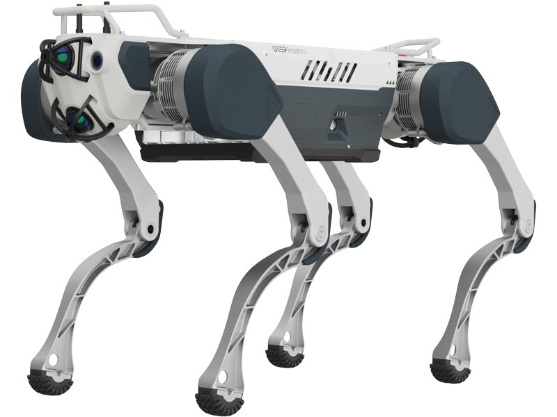

# Four-legged Robot Spot

## Description
The Four-legged Robot Spot is a versatile robotic platform designed for research, exploration, and lab automation.

## Files
- [Download Manual (PDF)](../assets/Four-legged Robot Spot/manual.pdf)
- [Download Specifications (Word)](../assets/Four-legged Robot Spot/specs.docx)

## Video Demo
<iframe width="560" height="315" src="https://www.youtube.com/embed/zxGwOEYYFVo " frameborder="0" allowfullscreen></iframe>

## Book This Equipment

<form action="mailto:your-email@example.com" method="post" enctype="text/plain">
  <label>Your Name:</label> 
  <input type="text" name="name">  

  <label>Date:</label> 
  <input type="date" name="date">  

  <label>Time:</label> 
  <input type="time" name="time">  

  <input type="submit" value="Submit Booking">
</form>
