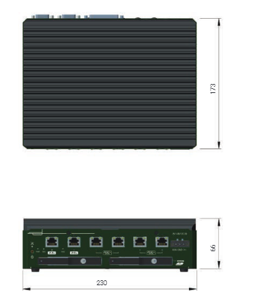

# Neousys NRU-220S Series

## Description
The Neousys NRU-220S Series is a powerful edge computing device optimized for AI-based robotics and machine vision applications.

## Files
- [Download Manual (PDF)](../assets/Neousys NRU-220S Series/manual.pdf)
- [Download Specifications (Word)](../assets/Neousys NRU-220S Series/specs.docx)

## Video Demo
<iframe width="560" height="315" src="https://www.youtube.com/embed/YOUTUBE_VIDEO_ID " frameborder="0" allowfullscreen></iframe>

## Book This Equipment

<form action="mailto:your-email@example.com" method="post" enctype="text/plain">
  <label>Your Name:</label> 
  <input type="text" name="name">  

  <label>Date:</label> 
  <input type="date" name="date">  

  <label>Time:</label> 
  <input type="time" name="time">  

  <input type="submit" value="Submit Booking">
</form>