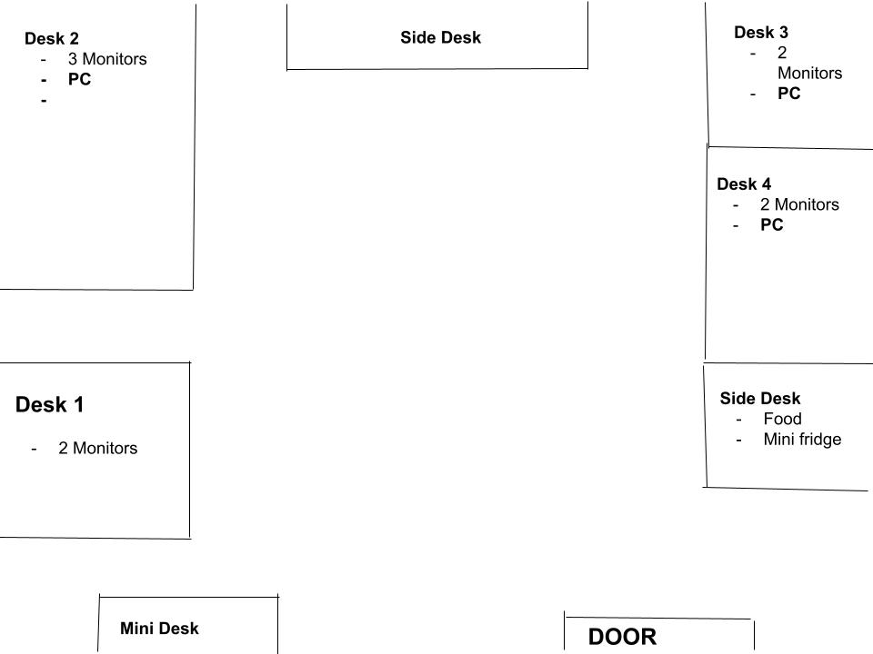
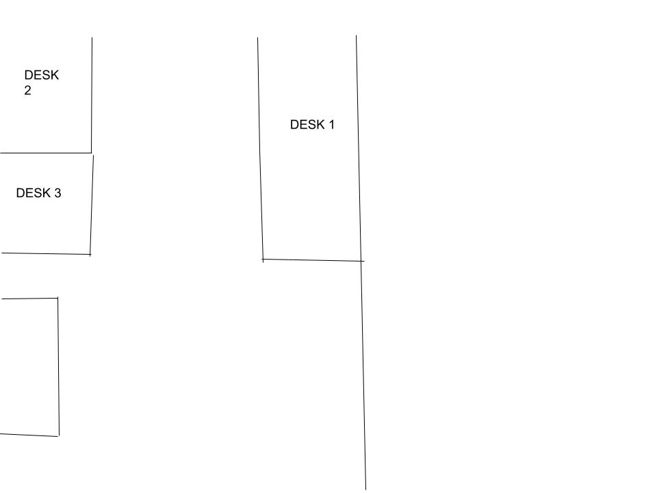

# Lab Space Overview

Welcome to the EMRC Lab space overview.  
Below are interactive floor plans showing **PC specs at each desk**.

---

## 🏢 Floor 1 – Room 1

Room 1 has 4 desks. Desks 2 and 3 have PCs. Desk 1 and 4 are empty.

  

  <!-- Desk 1 -->
  

    Desk 1
    

      <h4>Desk 1</h4>
      
This desk is currently empty.

    

  

  <!-- Desk 2 -->
  

    Desk 2
    

      <h4>Desk 2 - PC Specs</h4>
      <ul>
        <li><strong>CPU:</strong> 12th Gen Intel(R) Core(™) i7-12700</li>
        <li><strong>Memory:</strong> 32 GB</li>
        <li><strong>GPU:</strong> NVIDIA Geforce RTX 3060</li>
      </ul>
    

  

  <!-- Desk 3 -->
  

    Desk 3
    

      <h4>Desk 3 - PC Specs</h4>
      <ul>
        <li><strong>CPU:</strong> 12th Gen Intel(R) Core (™) i7-12700 @ 2.10GHz</li>
        <li><strong>Memory:</strong> 16 GB</li>
        <li><strong>GPU:</strong> NVIDIA Geforce RTX 3060</li>
      </ul>
    

  

  <!-- Desk 4 -->
  

    Desk 4
    

      <h4>Desk 4 - PC Specs</h4>
      <ul>
        <li><strong>CPU:</strong> 12th Gen Intel(R) Core (™) i7-12700 @ 2.10GHz</li>
        <li><strong>Memory:</strong> 16 GB</li>
        <li><strong>GPU:</strong> NVIDIA Geforce RTX 3060</li>
      </ul>
    

  

---

## 🏗️ Floor 3 Office

### Room 1 – 3 Desks

  

  <!-- Desk 1 -->
  

    Desk 1
    

      <h4>Desk 1 - PC Specs</h4>
      <ul>
        <li><strong>CPU:</strong> 13th Gen Intel Core i7-13700 F x 24</li>
        <li><strong>Memory:</strong> 32 GB</li>
        <li><strong>GPU:</strong> NVIDIA Geforce RTX 4070</li>
      </ul>
    

  

  <!-- Desk 2 -->
  

    Desk 2
    

      <h4>Desk 2 - PC Specs</h4>
      <ul>
        <li><strong>CPU:</strong> AMD Ryzen 7 5700X 8 Core Processor</li>
        <li><strong>Memory:</strong> 16 GB</li>
        <li><strong>GPU:</strong> NVIDIA Geforce RTX 4060 Ti</li>
      </ul>
    

  

  <!-- Desk 3 -->
  

    Desk 3
    

      <h4>Desk 3 - PC Specs</h4>
      <ul>
        <li><strong>CPU:</strong> 13th Gen Intel Core i7-13700 F x 24</li>
        <li><strong>Memory:</strong> 32 GB</li>
        <li><strong>GPU:</strong> NVIDIA Geforce RTX 4070</li>
      </ul>
    

  

---

### Room 2 – 3 Desks

  

  <!-- Desk 1 -->
  

    Desk 1
    

      <h4>Desk 1 - PC Specs</h4>
      <ul>
        <li><strong>CPU:</strong> AMD Ryzen 7</li>
        <li><strong>Memory:</strong> 16 GB</li>
        <li><strong>GPU:</strong> NVIDIA Geforce RTX 4070</li>
      </ul>
    

  

  <!-- Desk 2 -->
  

    Desk 2
    

      <h4>Desk 2 - PC Specs</h4>
      <ul>
        <li><strong>CPU:</strong> AMD Ryzen 7</li>
        <li><strong>Memory:</strong> 16 GB</li>
        <li><strong>GPU:</strong> NVIDIA Geforce RTX 2060 Ti</li>
      </ul>
    

  

  <!-- Desk 3 -->
  

    Desk 3
    

      <h4>Desk 3 - PC Specs</h4>
      <ul>
        <li><strong>CPU:</strong> 13th Gen Intel Core i7-13700 F x 24</li>
        <li><strong>Memory:</strong> 32 GB</li>
        <li><strong>GPU:</strong> NVIDIA Geforce RTX 4070</li>
      </ul>
    

  

