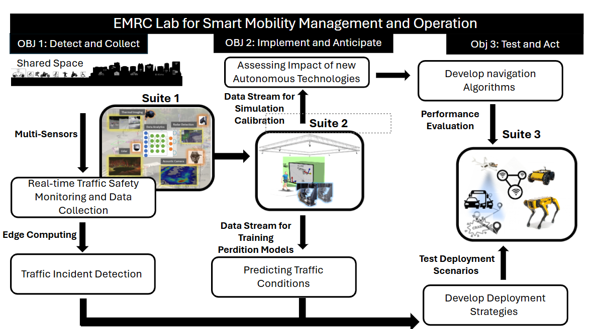

# Overview

Welcome to the EMRC Lab for Smart Mobility Management and Operation!

This lab focuses on advancing technologies for smart mobility through research and development. Below is an overview of our workflow and objectives:

### Objectives

1. **Detect and Collect**: Detect and collect data from various sources.
2. **Implement and Anticipate**: Assess the impact of new autonomous technologies.
3. **Test and Act**: Develop strategies based on performance evaluations.

